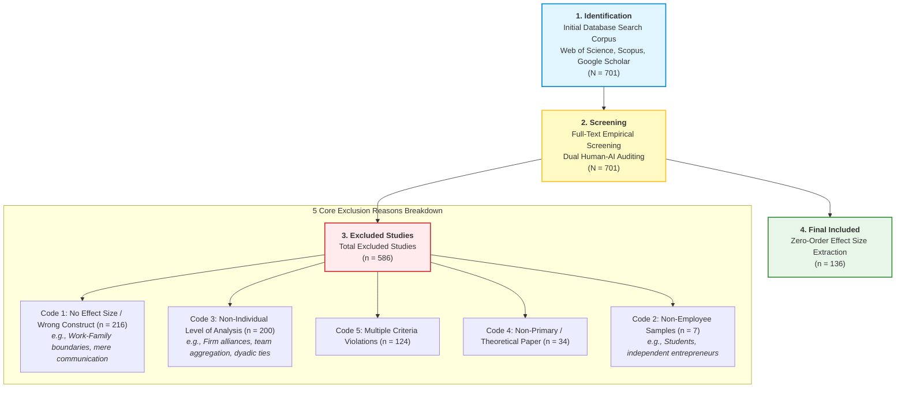

# BSMA: Boundary Spanning Behavior Meta-Analysis

> **Automated AI-Orchestrated Meta-Analysis Pipeline and Empirical Database**  
> *Department of Management & International Business, University of Oklahoma*

[](https://www.python.org/downloads/)
[]()
[-blue.svg)]()
[-success.svg)]()
[]()
[]()

---

## 1. Project Overview and Research Context

### What is Boundary Spanning Behavior (BSB)?
In organizational theory and organizational behavior (OB), **Boundary Spanning Behavior (BSB)** refers to the purposive, interpersonal actions taken by organizational members to bridge boundaries between their own work unit/organization and external entities. It encompasses:
1. **Scouting / Information Search:** Scanning external environments, tracking competitive intelligence, and acquiring novel external knowledge.
2. **Ambassadorial / External Representation:** Buffering internal teams, managing external stakeholder expectations, and persuading others for critical unit resources.
3. **Task Coordination:** Synchronizing complex workflows and establishing cooperative links across departments (intra-organizational) or partner organizations (inter-organizational).

### Research Objectives and Meta-Analytic Scope
Across 50 years of scholarship (1973–2024), empirical findings regarding the antecedents (e.g., leadership styles, job design, psychological traits) and consequences (e.g., job performance, innovation, burnout, turnover intention) of BSB have remained fragmented across management, marketing, psychology, and information systems literatures.

This project conducts a comprehensive, large-scale **Meta-Analysis** to statistically synthesize bivariate zero-order correlation effect sizes ($r$) and test critical theoretical moderators across a global corpus of **701 academic papers**.

### Human-AI Collaborative Methodology
Manual full-text screening and parameter extraction across 701 empirical papers traditionally suffer from coder fatigue, heuristic biases, and hallucination risks. This repository implements an **AI-orchestrated dual-auditing pipeline**:
* **Two-Stage Reliability Framework:**
  * **Stage 1 (Pre-Resolution Independent Screening):** Achieved an initial unassisted agreement rate of **96.15% (Cohen's $\kappa = 0.8520$)** across all 701 papers without inter-rater communication.
  * **Stage 2 (Post-Adjudication Consensus):** Following expert faculty adjudication of 27 discrepancies, achieved a final consensus agreement rate of **99.43% (Cohen's $\kappa = 0.9810$)**.
* **Dual-Phase Automation:** 
  * **Phase 1 (Screening):** High-throughput automated screening against 8 core theoretical exclusion rules.
  * **Phase 2 (Data Extraction):** 4-node parallel extraction loop parsing sample size ($N$), correlation coefficients ($r$), means/SDs, and reliability metrics ($\alpha$).

---

## 2. Meta-Analytic Literature Flow (PRISMA 2020)



---

## 3. Repository Directory Architecture

The workspace strictly enforces a clean, numbered sequential directory system designed for reproducible science.

```
BSMA/
├── 01_Academic_Papers/              # 701 Primary PDFs in canonical [ID] format
├── 02_Reference_Manuals/            # Operational coding manuals & student guidelines
├── 03_Coding_Sheets/                # Master Excel databases & human coding baselines
├── 04_Reports/                      # Diagnostic reports, error logs, and changelogs
├── 99_Archives_and_Backups/         # Read-only immutable vault and milestone backups
├── .agents/                         # AI orchestrator prompt, modular rules, and skills
├── scratch/                         # Ephemeral processing directory (strictly isolated)
├── README.md                        # Master project documentation
└── .gitignore                       # Git exclusion rules
```

### Directory Specifications

| Directory | Description | Key Assets |
|---|---|---|
| [`01_Academic_Papers/`](file:///01_Academic_Papers/) | Complete repository of 701 academic papers. Every file strictly adheres to `[ID] Author (Year) - Title.pdf`. Zero non-PDF files allowed. | `[1] ...pdf` ~ `[701] ...pdf` |
| [`02_Reference_Manuals/`](file:///02_Reference_Manuals/) | Detailed coding protocols, variable operationalizations, and theoretical inclusion/exclusion guidelines. | `Coding manual for students_0625.docx` |
| [`03_Coding_Sheets/`](file:///03_Coding_Sheets/) | Central ground truth and full-text extraction spreadsheets. | `BSMA_Master_Coding_Sheet.xlsx`<br>`Full text coding sheet.xlsx` *(123 papers / 145 coded rows)*<br>`49_53_66.xlsx` |
| [`04_Reports/`](file:///04_Reports/) | Statistical audits, inter-rater reliability logs, and diagnostic reports. | `Match_Rate_Report.md`<br>`error_report.md`<br>`CHANGELOG.md`<br>`workspace_lint_report.md` |
| [`99_Archives_and_Backups/`](file:///99_Archives_and_Backups/) | Immutable baseline snapshots and automated zip milestones. | `NEVER_CHANGE_IN_ANY_CASES/`<br>`02_Database_Milestones/` |

---

## 4. Execution Commands and Workflows

### 1. Unified Repository and Data Audit (/lint)
Audits root hygiene, PDF filenames, Excel columns, verbatim quotes, and agent rule synchronization.
```bash
# Run full diagnostic audit
python .agents/scripts/linter.py

# Auto-clean temporary caches
python .agents/scripts/linter.py --fix
```
*In Antigravity Chat UI, type:* `/lint`

### 2. Phase 1 Screening Pipeline (/includeexclude)
Executes the high-throughput screening engine on pending academic papers.
*In Antigravity Chat UI, type:* `/includeexclude`

### 3. Automated Milestone Backup
Creates a timestamped zip snapshot of all active databases and reports:
```bash
python .agents/scripts/backup_manager.py
```

---

## 5. Inter-Rater Reliability and Verification

Comparison of 701 academic papers between Human Ground Truth and Automated AI Screening across the two methodological stages:

| Evaluation Stage | Scope / Sample | Exact Matches | Discrepancies | Agreement Rate | Cohen's Kappa ($\kappa$) | Methodological Interpretation |
|---|---|---|---|---|---|---|
| **Stage 1: Pre-Resolution (Independent Blind Screening)** | 701 Papers | 674 | 27 | **96.15%** | **0.8520** | Independent blind evaluation; *Almost Perfect* baseline agreement |
| **Stage 2: Post-Adjudication (Consensus Resolution)** | 701 Papers | 697 | 4* | **99.43%** | **0.9810** | Consensus reached following expert faculty adjudication |

*\*The remaining 4 boundary cases represent specialized qualitative/mixed-methods nuances preserved for transparency.*

* **Total Academic Papers Audited:** 701 papers (100% Census Audit)
* **Human-Verified Included Dataset:** 123 unique papers (145 coded rows in `03_Coding_Sheets/Full text coding sheet.xlsx`)
* **Final Inter-Rater Consensus Agreement:** **99.43%**
* **Final Cohen's Kappa ($\kappa$):** **`0.98`** *(Near Perfect Agreement, Landis & Koch standard)*

> [!NOTE]
> Detailed paper-by-paper discrepancy justifications, professor override rulings, and methodological precedents are permanently preserved in [`.agents/memory.md`](file:///.agents/memory.md).
